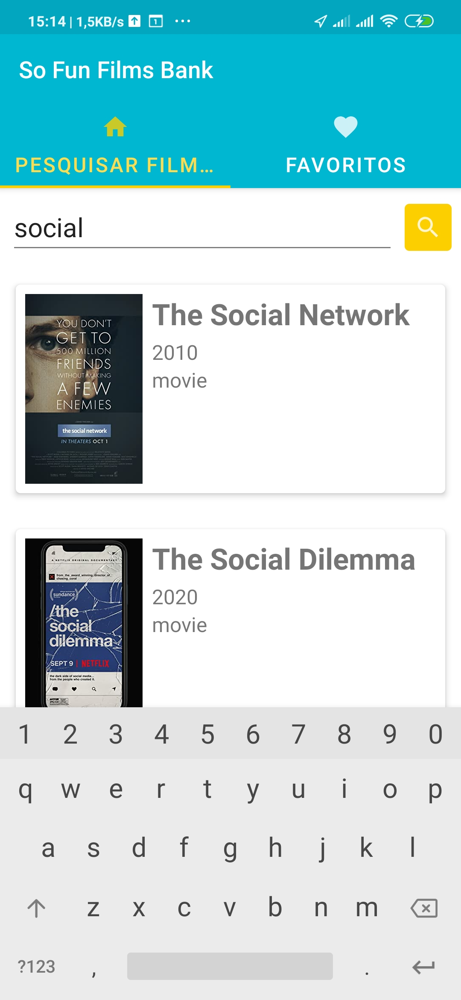

# SoFunFilmsBank

Pesquise e obtenha informações sobre as principais séries e filmes

**Pré requisitos:**
Para testar o aplitivo você precisa ter o [Android Studio](https://developer.android.com/studio/install?hl=pt-br) ou o Intellij instalado no seu computador.
Em seguida você pode fazer um clone do projeto e testar em um emulador ou no dispositivo físico

### Tecnologias utilizadas:

- [x] [Kotlin](https://kotlinlang.org/docs/getting-started.html)
- [x] [Live data](https://developer.android.com/topic/libraries/architecture/livedata?hl=pt-br)
- [x] [MVVM](https://developer.android.com/jetpack/guide?gclid=CjwKCAiAjp6BBhAIEiwAkO9Wut2W9TLNRaql75qE26vP_xRvCfTBlBY5j8RHxc_r6RhC1HFPTprbwRoC32cQAvD_BwE&gclsrc=aw.ds) 
- [x] [Coil](https://coil-kt.github.io/coil/)
- [x] [Retrofit](https://square.github.io/retrofit/)
- [x] [Room](https://developer.android.com/training/data-storage/room)

### Telas do App

  
  
  
  

### Pontos a serem melhorados
1. Corrigir erros ao salvar um filme favorito (ROOM)

	1.1. Ao salvar um filme favorito há leg e o botão favorito não muda de cor na primeira tentativa
  
	1.2 Após salvar ou deletar um filme favorito o repository não notifica o ViewModel
2. Refatorar a arquitetura do App com Paging
3. Refatorar layout para single activity
4. Aplicar testes automatizados
